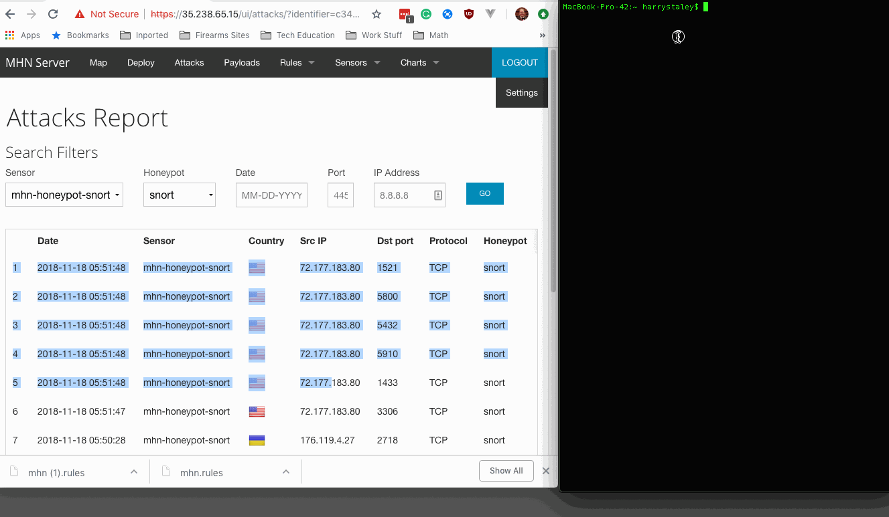

# CSCI4349 Week 9: Honeypot

## Which Honeypot(s) you deployed

HONEYPOT | NAME | ZONE | MACHINE_TYPE 	| PREEMPTIBLE | INTERNAL_IP | EXTERNAL_IP | STATUS
-----|-----|------|--------------	|-------------|-------------|-------------|---------
N/A 			| mhn-admin  					| us-central1-c | f1-micro  |             | 10.128.0.2  | 35.238.65.15   | RUNNING
dionea 			| mhn-honeypot-dionaea  		| us-central1-c | f1-micro  |             | 10.128.0.3  | 35.202.115.178 | RUNNING
wordpot 		| mhn-honeypot-wordpot  		| us-central1-c | f1-micro  |             | 10.128.0.4  | 35.238.4.126   | RUNNING
shockpot 		| mhn-honeypot-shockpot  		| us-central1-c | f1-micro  |             | 10.128.0.5  | 35.202.178.69  | RUNNING
dionea w. http 	| mhn-honeypot-diondeahttp  	| us-central1-c | f1-micro  |             | 10.128.0.6  | 35.224.95.32   | RUNNING
snort 			| mhn-honeypot-snort  			| us-central1-c | f1-micro  |             | 10.128.0.7  | 104.197.157.56 | RUNNING


## Attacks Executed

- snort



## Any issues you encountered
- I needed to either modify one of the shell scripts at first but I thien foudn tthe upstream of the repo from Threatstream located at [Trheatstream: MHN](https://github.com/threatstream/mhn) to be much better maintained than teh one located by [RedolentSun: mhn](https://github.com/RedolentSun/mhn.git)


- Recieved the following error after complete install.
```
harrystaley@mhn-admin:/opt/mhn/scripts$ sudo supervisorctl status
geoloc                           FATAL      Exited too quickly (process log may have details)
honeymap                         RUNNING    pid 1564, uptime 2:02:23
hpfeeds-broker                   FATAL      Exited too quickly (process log may have details)
mhn-celery-beat                  RUNNING    pid 1544, uptime 2:02:23
mhn-celery-worker                RUNNING    pid 1562, uptime 2:02:23
mhn-collector                    RUNNING    pid 1563, uptime 2:02:23
mhn-uwsgi                        RUNNING    pid 1561, uptime 2:02:23
mnemosyne                        RUNNING    pid 1559, uptime 2:02:23
```

When I inspected the geoloc.err file I found that python was trying to import a package titled hpfeeds, so I executed
```
sudo pip install hpfeeds
```
I am nogetting the following results.
```
harrystaley@mhn-admin:/opt/mhn/scripts$ sudo supervisorctl status
geoloc                           FATAL      Exited too quickly (process log may have details)
honeymap                         RUNNING    pid 5504, uptime 0:00:44
hpfeeds-broker                   RUNNING    pid 5474, uptime 0:00:46
mhn-celery-beat                  RUNNING    pid 5473, uptime 0:00:46
mhn-celery-worker                RUNNING    pid 5483, uptime 0:00:46
mhn-collector                    FATAL      Exited too quickly (process log may have details)
mhn-uwsgi                        RUNNING    pid 5482, uptime 0:00:46
mnemosyne                        RUNNING    pid 5477, uptime 0:00:46
```
Now hpfeeds-broker is fixed, but I have a new error.

Looked in Geoloc.err in /var/log/mhn and found an error where python is not finding amodule named GeoIp
```
sudo pip install GeoIp
```
Now I got the following message after running ```sudo systemctl restart all```.
```
harrystaley@mhn-admin:/var/log/mhn$ sudo supervisorctl status
geoloc                           RUNNING    pid 8324, uptime 0:04:46
honeymap                         RUNNING    pid 8347, uptime 0:04:44
hpfeeds-broker                   RUNNING    pid 8316, uptime 0:04:48
mhn-celery-beat                  RUNNING    pid 8315, uptime 0:04:48
mhn-celery-worker                RUNNING    pid 8329, uptime 0:04:46
mhn-collector                    FATAL      Exited too quickly (process log may have details)
mhn-uwsgi                        RUNNING    pid 8325, uptime 0:04:46
mnemosyne                        RUNNING    pid 8321, uptime 0:04:47
```

- Rebuilt using Ubuntu 14.04
- navigated to ```/opt/mhn/scrpts``` and modified by running ```sudo vim install_hpfeeds.sh```
- Changed ```sudo git clone https://github.com/RedolentSun/pyev.git#egg=pyev``` to ```sudo git clone https://github.com/couozu/pyev.git#egg=pyev```
- The following setup shows runnning without errors.
```
harrystaley@mhn-admin:/opt/mhn$ sudo supervisorctl status
geoloc                           RUNNING    pid 32313, uptime 0:35:20
honeymap                         RUNNING    pid 32314, uptime 0:35:20
hpfeeds-broker                   RUNNING    pid 12449, uptime 0:44:18
mhn-celery-beat                  RUNNING    pid 1544, uptime 0:03:44
mhn-celery-worker                RUNNING    pid 1633, uptime 0:00:26
mhn-collector                    RUNNING    pid 1546, uptime 0:03:44
mhn-uwsgi                        RUNNING    pid 1548, uptime 0:03:44
mnemosyne                        RUNNING    pid 30344, uptime 0:37:27
harrystaley@mhn-admin:/opt/mhn$ sudo /etc/init.d/nginx status
 * nginx is running
harrystaley@mhn-admin:/opt/mhn$ sudo /etc/init.d/supervisor status
 is running
```


## A summary of the data collected: number of attacks, number of malware samples, etc.

My public IP Address - 72.177.183.80


## Any unresolved questions raised by the data collected


## Honeypot Details

### Firewall Setup

```
gcloud beta compute firewall-rules create mhn-allow-honeypot --direction=INGRESS --priority=1000 --network=default --action=ALLOW --rules=all --source-ranges=0.0.0.0/0 --target-tags=mhn-honeypot
```

### Honeypot VM Setup

```
gcloud compute instances create "mhn-honeypot-1" --machine-type "f1-micro" --subnet "default" --maintenance-policy "MIGRATE"  --scopes "https://www.googleapis.com/auth/devstorage.read_only","https://www.googleapis.com/auth/logging.write","https://www.googleapis.com/auth/monitoring.write","https://www.googleapis.com/auth/servicecontrol","https://www.googleapis.com/auth/service.management.readonly","https://www.googleapis.com/auth/trace.append" --tags "mhn-honeypot","http-server" --image "ubuntu-1404-trusty-v20171010" --image-project "ubuntu-os-cloud" --boot-disk-size "10" --boot-disk-type "pd-standard" --boot-disk-device-name "mhn-honeypot-1"
```

## Self Signed SSL Cert setup

You can get a simmilar tutorial at [Digital Ocean: Self Signed SSL cert on NGINX for Ubuntu 14.04](https://www.digitalocean.com/community/tutorials/how-to-create-an-ssl-certificate-on-nginx-for-ubuntu-14-04).

1. I first logged into my admin server, made an ssl directory and ran the command to create my cert.

```
gcloud compute ssh mhn-admin
sudo mkdir /etc/nginx/ssl
sudo openssl req -x509 -nodes -days 365 -newkey rsa:2048 -keyout /etc/nginx/ssl/nginx.key -out /etc/nginx/ssl/nginx.crt
```

2. I next answered a series of prompts

```
Country Name (2 letter code) [AU]:US
State or Province Name (full name) [Some-State]:Nevada
Locality Name (eg, city) []:Las Vegas
Organization Name (eg, company) [Internet Widgits Pty Ltd]:Minestry of Magic
Organizational Unit Name (eg, section) []:Department of Magical Law Enforcement
Common Name (e.g. server FQDN or YOUR name) []:35.238.65.15
Email Address []:admin@OrderOfThePheonix.com
```

3. Next is modified my server block file

```
cd /etc/nginx/sites-available
sudo vim default
```

4. Modified the file adding the following server block to the end of the file.

```
server {
    listen 443 ssl;

    server_name _;
    ssl_certificate /etc/nginx/ssl/nginx.crt;
    ssl_certificate_key /etc/nginx/ssl/nginx.key;;

    location / {
        try_files $uri @mhnserver;
    }

    root /opt/www;

    location @mhnserver {
      include uwsgi_params;
      uwsgi_pass unix:/tmp/uwsgi.sock;
    }

    location  /static {
      alias /opt/mhn/server/mhn/static;
    }
}
```

5.  Restart nginx

```
sudo service nginx restart
```

6. Open port 443 for mhn-admin in your gcloud or other firewall rules.

